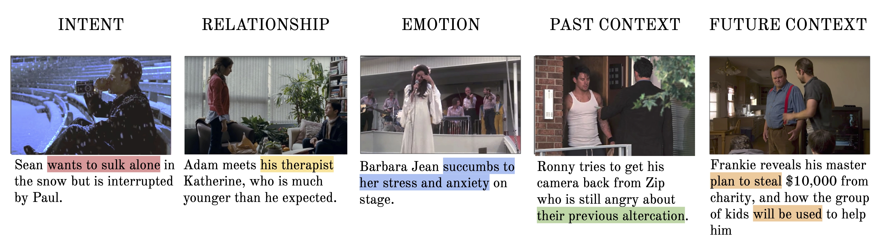

## CondensedMovies

This repository contains the video dataset, implementation and baselines from <strong>Condensed Movies: Story Based Retrieval with Contextual Embeddings</strong>.

[Project page](https://www.robots.ox.ac.uk/~vgg/research/condensed-movies) |
[arXiv preprint](https://arxiv.org/abs/2005.04208) |
[Read the paper](https://arxiv.org/pdf/2005.04208.pdf) |
[Preview the data](https://www.robots.ox.ac.uk/~vgg/research/condensed-movies/#preview)

----
### CondensedMovies Dataset

The dataset consists of 3K+ movies, 30K+ professionally captioned clips, 1K+ video hours, 400K+ facetracks & precomputed features from 6 different modalities.

#### Installation

Requirements:
- Storage
    - 20GB for features
    - 250GB for source videos (optional)
- Libraries
    - ffmpeg (video download)
    - youtube-dl (video download)
    - pandas, numpy
    - python 3.6+

#### Prepare Data

1. Navigate to directory `cd CondensedMovies/prep/`
2. Edit configuration file `config.json` to suit your needs.
3. If downloading the source videos (`src: true`), you can edit `youtube-dl.conf` for desired resolution, subtitles etc.
Please see [youtube-dl](https://github.com/ytdl-org/youtube-dl) for more info
4. Run `python download.py`

### Training and Inference

Coming soon
##### TODO:
- [x] youtube download script
- [x] missing videos check
- [x] precomputed features download script
- [ ] dataloader
- [ ] video-text retrieval baselines
- [ ] facetrack visualisation

##### FAQ

Why did some of the source videos fail to download?
>This is most likely due to geographical restrictions on the videos, email me at maxbain@robots.ox.ac.uk and I can help.

The precomputed features are averaged over the temporal dimension, will you release the original features?
>This is to save space, original features in total are ~1TB, contact me to arrange download of this.

I think clip X is incorrectly identified as being from movie Y, what do do?
>Please let me know any movie identification mistakes and I'll correct it ASAP.
